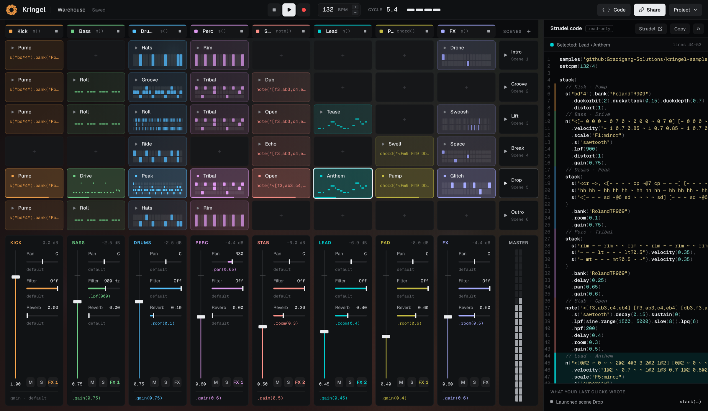

<div align="center">


# Kringel

**Make loops with clicks. Learn Strudel by reading what they write.**

A clip launcher for the browser, built on top of [Strudel](https://strudel.cc).
Every click in the grid writes Strudel code, and you can watch it change as you play.

[**▶ Try the live demo**](https://kringel.turbosoupe.dev) · [Report a bug](https://github.com/Gradigang-Solutions/kringel/issues) · [Strudel docs](https://strudel.cc/learn)

<br />

<a href="https://kringel.turbosoupe.dev">
  
</a>

</div>

---

## Why Kringel?

Strudel sounds great, but its syntax scares off a lot of curious people. Classic DAWs go the other way and hide the musical logic behind knobs and menus.

Kringel sits in between. It's as easy to use as a clip grid, and nothing is hidden: **the code panel is always open, and it updates with every click.** Program a beat, sketch a bassline, launch a scene, and read the code you just made.

When you're ready, open the code in the Strudel REPL and keep going from there.

## Features

- **Clip grid with scenes**: launch clips or whole scenes. Launches wait for the start of the next cycle, so you never fall out of time.
- **Step sequencer**: 16 steps, several sounds per clip, velocity per step, swing, and a choice of drum kits.
- **Piano roll**: notes snapped to a scale, a choice of synth or sampled instrument, clips several cycles long.
- **Code clips**: write raw Strudel when the UI isn't enough, with live error checking.
- **Mixer**: volume, pan, low- and high-pass filters, reverb, delay and distortion per track, plus mute and solo.
- **Live code panel**: generated code that's indented and readable, with one color per track and the selected clip highlighted. Copy it, or open it in Strudel.
- **Demo projects**: four working songs (techno, lo-fi hip-hop, acid, synthwave) that you can take apart clip by clip.
- **Saving and sharing**: autosaves in your browser, imports and exports JSON, and shares a whole project as one link with no server involved.
- **Recording**: capture what you play as a WAV file.

## How it works

```
 Project model ──► Code generator ──► Strudel code ──► Strudel engine ──► 🔊
 (source of truth)   (pure function)    (what you read)
```

The project model is the single source of truth. The Strudel code is always **generated from it** and never parsed back. The generator is a pure function, `(project, playback state) → string`, covered by snapshot tests. That's why the code you see is always exactly what you hear.

Strudel itself is isolated behind a single module (`src/engine/`), so the rest of the app never talks to it directly.

## Getting started

Requires **Node.js 22+**.

```bash
git clone https://github.com/Gradigang-Solutions/kringel.git
cd kringel
npm install
npm run dev
```

Then open the URL Vite prints and press play. Browsers only allow audio after you click something, so nothing plays before that.

| Command             | What it does                  |
| ------------------- | ----------------------------- |
| `npm run dev`       | Start the dev server          |
| `npm run build`     | Production build into `dist/` |
| `npm run test`      | Run the Vitest suite          |
| `npm run lint`      | Lint with ESLint              |
| `npm run typecheck` | Type-check with `tsc`         |
| `npm run format`    | Format with Prettier          |

There's no backend: Kringel is a static site. The Web Audio API needs HTTPS, so serve it over HTTPS in production.

## Tech stack

[Strudel](https://strudel.cc) · React · TypeScript (strict) · Vite · Zustand · Tailwind CSS · Radix Primitives · CodeMirror 6 · Canvas 2D · Dexie (IndexedDB) · Zod · Vitest

## Project layout

```
src/
  model/     Project types, domain constants, pure update functions
  codegen/   Model → Strudel code (the heart of the project)
  engine/    The only module that talks to Strudel
  store/     Zustand stores and selectors
  ui/        Grid, mixer, editors, code panel, transport
  storage/   IndexedDB persistence, JSON import/export
  demos/     Demo projects
```

## Sounds

Drum kits come from [kringel-samples](https://github.com/Gradigang-Solutions/kringel-samples), a set of CC0 samples. Some instruments are streamed from the sample packs that strudel.cc serves. In the app, **Project → About & credits** lists every source and its license.

## License

[AGPL-3.0](LICENSE), as required by Strudel.

<div align="center">
<br />
Made by <a href="https://github.com/Gradigang-Solutions"><b>Gradigang Solutions</b></a>
</div>
